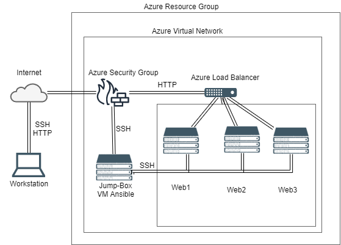

# ELK-Stack-Project
configuration of an ELK stack server to set up a cloud monitoring system

## Automated ELK Stack Deployment

The files in this repository were used to configure the network depicted below.

These files have been tested and used to generate a live ELK deployment on Azure. They can be used to either recreate the entire deployment pictured above.
Alternatively, select portions of the Ansible folder may be used to install only certain pieces of it, such as Filebeat.

  - [Ansible](Ansible)

This document contains the following details:
- Description of the Topology
- Access Policies
- ELK Configuration
  - Beats in Use
  - Machines Being Monitored
- How to Use the Ansible Build

### Description of the Topology

The main purpose of this network is to expose a load-balanced and monitored instance of DVWA, the D*mn Vulnerable Web Application.

Load balancing ensures that the application will be highly responsive, in addition to restricting overload to the network.
Load balancing protects against DoS or DDoS attacks by shifting attack traffic. The advantage of a jump box is that it can prevent all machines in a network from being exposed to the public.

Integrating an ELK server allows users to easily monitor the vulnerable VMs for changes to the logs and system traffic.
- Filebeat watches for log files, collects them, and monitors them.
- Metricbeat records metric data from the operating system.

The configuration details of each machine may be found below.

| Name       | Function  | IP Address | Operating System |
|------------|-----------|------------|------------------|
| Jump box   | Gateway   | 10.0.0.4   | Linux            |
| Web1       | Webserver | 10.0.0.5   | Linux            |
| Web2       | Webserver | 10.0.0.6   | Linux            |
| ELK Server | ELK-stack | 10.1.0.4   | Linux            |

### Access Policies

The machines on the internal network are not exposed to the public Internet. 

Only the Jump box machine can accept connections from the Internet. Access to this machine is only allowed from home network IP.

Machines within the network can only be accessed by home network IP

A summary of the access policies in place can be found in the table below.

| Name       | Publicly Accessible | Allowed IP Addresses |
|------------|---------------------|----------------------|
| Jump box   | No                  | 10.0.0.1 10.0.0.2    |
| Web1       | No                  | 10.0.0.4 0 & home IP |
| Web2       | No                  | 10.0.0.4 0 & home IP |
| ELK Server | No                  | 10.0.0.4 0 & home IP |

### Elk Configuration

Ansible was used to automate configuration of the ELK machine. No configuration was performed manually, which is advantageous because it streamlines processes to be time-saving and less likely to have errors. 

The playbook implements the following tasks:
- Configuring Webservers
- Installing the ELK Server
- Installing Filebeat
- Installing Metricbeat

The following screenshot displays the result of running `docker ps` after successfully configuring the ELK instance.

[ELK Docker PS](Images/elk_docker_ps.png)

  
### Target Machines & Beats
This ELK server is configured to monitor the following machines:
- 10.0.0.5
- 10.0.0.6

We have installed the following Beats on these machines:
- Filebeat
- Metricbeat

These Beats allow us to collect the following information from each machine:
- Filebeat forwards, monitors, and centralizes log data. It is often used to collect log files from files generated in Microsoft Azure tools, among others.
- Metricbeat provides a way to monitor servers and collect metrics from the operating system. 

### Using the Playbook
In order to use the playbook, you will need to have an Ansible control node already configured. Assuming you have such a control node provisioned: 

SSH into the control node and follow the steps below:
- Copy the Ansible folder to /etc/ansible.
- Update the hosts file to include webserver IP's and ELKServer IP
- Run the playbook, and navigate to HTTP://<ELKServer_Public_IP>:5601 to check that the installation worked as expected.

* Copy the Ansible folder and the files inside to /etc/ansible
* Update the /etc/ansible/hosts file to include the IPs of the Web servers and ELK Server
* Change each configuration file to include the IP of ELKServer
    * Kibana: replace localhost with the local IP of ELK Server
    * Elasticsearch: replace localhost with the local IP of ELK Server